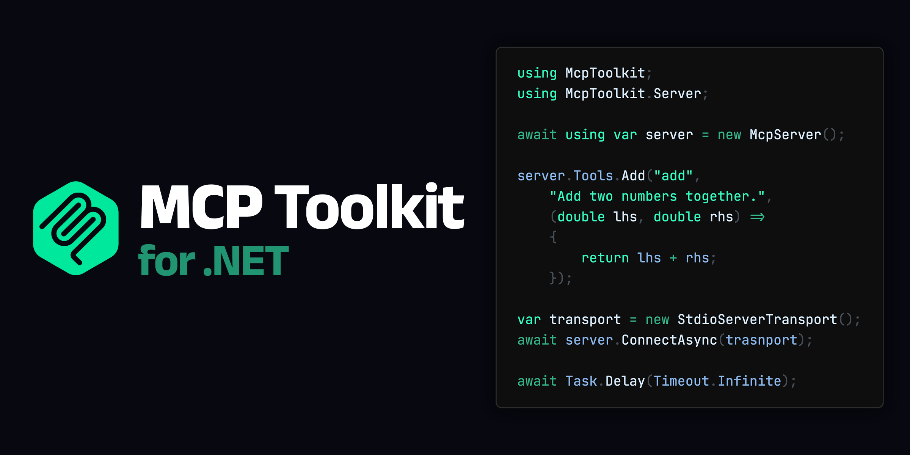

# MCP Toolkit for .NET
Lightweight, fast, NativeAOT compatible MCP (Model Context Protocol) framework for .NET



[](https://www.nuget.org/packages/McpToolkit)
[](https://github.com/nuskey8/McpToolkit/releases)
[](LICENSE)

English | [日本語](./README_JA.md)

MCP Toolkit for .NET is a framework for building MCP (Model Context Protocol) servers/clients in .NET. By leveraging Source Generators, it enables the creation of MCP servers/clients with minimal C# code.

```cs
using McpToolkit;
using McpToolkit.Server;

await using var server = new McpServer();

server.Tools.Add("add", "Add two numbers together.", (double lhs, double rhs) =>
{
    return lhs + rhs;
});

await server.ConnectAsync(new StdioServerTransport());
await Task.Delay(Timeout.Infinite);
```

> [!CAUTION]
> MCP Toolkit for .NET is currently in alpha and may introduce breaking changes without notice. Additionally, the following features are under development and not yet supported:
> 
> * Streamable HTTP Transport
> * Authorization
> * Cancellation
> * Progress

## Why not C# SDK?

An [official C# SDK](https://github.com/modelcontextprotocol/csharp-sdk) for the Model Context Protocol already exists. So why use MCP Toolkit?

### Clear and Easy to Use API

MCP Toolkit fully utilizes Source Generators to provide an intuitive and user-friendly API. Below is a comparison of implementing the same MCP server using the C# SDK and MCP Toolkit.

```cs
// C# SDK
using Microsoft.Extensions.DependencyInjection;
using Microsoft.Extensions.Hosting;
using Microsoft.Extensions.Logging;
using ModelContextProtocol.Server;
using System.ComponentModel;

var builder = Host.CreateApplicationBuilder(args);

builder.Services
    .AddMcpServer()
    .WithStdioServerTransport()
    .WithToolsFromAssembly();

await builder.Build().RunAsync();

[McpServerToolType]
public static class EchoTool
{
    [McpServerTool, Description("Echoes the message back to the client.")]
    public static string Echo(string message) => $"hello {message}";
}
```

```cs
// MCP Toolkit for .NET
using McpToolkit;
using McpToolkit.Server;

await using var server = new McpServer();

server.Tools.Add("echo",
    "Echoes the message back to the client.",
    (string message) => $"hello {message}");

await server.ConnectAsync(new StdioServerTransport());
await Task.Delay(Timeout.Infinite);
```

MCP Toolkit analyzes the lambda expressions passed to `server.Tools.Add()` and generates the necessary source code. It also supports adding tools at the class level, similar to the C# SDK.

### Zero Dependency

Unlike the C# SDK, which depends on `Microsoft.Extensions.AI` and `Microsoft.Extensions.Hosting`, MCP Toolkit has no external dependencies.

While MCP is a protocol for integrating LLMs with applications, MCP itself is a simple JSON-RPC and does not inherently include LLM-related features. Therefore, the functionality provided by `Microsoft.Extensions.AI` is unnecessary for implementing a basic MCP server.

Integration with `Microsoft.Extensions.Hosting` is optional in MCP Toolkit and is provided as an extension package. `Microsoft.Extensions.Hosting` is a large package, and its dependency can significantly increase binary size, especially in Native AOT scenarios. While Generic Host is powerful for web application implementations, it is not essential for implementing local MCP servers/clients.

### NativeAOT Compatible

MCP Toolkit does not perform any dynamic code generation, making it fully compatible with Native AOT. This allows for reduced binary size and startup time through AOT compilation.

## Requirements

MCP Toolkit requires .NET 8 or later. All necessary packages are available on NuGet.

## Getting Started (Server)

### Installation

To implement an MCP server, you need the `McpToolkit.Server` package.

#### .NET CLI

```
dotnet add package McpToolkit.Server
```

#### Package Manager

```ps1
Install-Package McpToolkit.Server
```

### Quick Start

You can easily implement an MCP server using `McpServer`.

```cs
await using var server = new McpServer
{
    Name = "Sample",
    Version = "1.0.0",
};

// Add tools
server.Tools.Add("foo", "Sample tool.", (string message) =>
{
    return $"test message: {message}";
});

// Use stdio as the transport
await server.ConnectAsync(new StdioServerTransport());

// Wait for client requests
await Task.Delay(Timeout.Infinite);
```

### Tool

You can add tools using `server.Tools.Add()`.

```cs
// Add tools
server.Tools.Add("add", "Add two numbers together.", (double lhs, double rhs) =>
{
    return lhs + rhs;
});
```

MCP Toolkit's Source Generator analyzes the lambda expressions in `Tools.Add()` and generates appropriate overloads.

<details>

<summary>Generated Code</summary>

```cs
// <auto-generated/>
#nullable enable
#pragma warning disable

using System.Text.Json;

namespace McpToolkit.Server
{
    internal static partial class GeneratedMcpServerToolsExtensions
    {
        public static void Add(this global::McpToolkit.Server.IMcpServerTools tools, string name, string? description, Func<double, double, double> action)
        {
            switch (name)
            {
                case "add":
                {
                    var inputSchema = global::System.Text.Json.JsonDocument.Parse(
                    """
                    {
                        "type": "object",
                        "properties": {
                            "lhs": {
                                "type": "number"
                            },
                            "rhs": {
                                "type": "number"
                            }
                        },
                        "required": ["lhs", "rhs"]
                    }
                    """).RootElement;

                    var tool = new global::McpToolkit.Tool()
                    {
                        Name = name,
                        Description = description,
                        InputSchema = inputSchema,
                    };

                    tools.Add(tool, (global::System.Text.Json.JsonElement? args, global::System.Threading.CancellationToken ct) =>
                    {
                        if (args == null)
                        {
                            throw new global::McpToolkit.McpException("Missing required argument 'lhs'");
                        }
                        var lhs = args.Value!.GetProperty("lhs").Deserialize<double>();
                        var rhs = args.Value!.GetProperty("rhs").Deserialize<double>();
                        return new([(action(lhs, rhs)).ToString()]);
                    });

                    break;
                }
            }
        }

    }
}
```

</details>

You can also register methods from a class. When adding tools using methods, the `<summary>` and `<param>` information from the method's documentation comments is automatically used to generate the `description`.

```cs
server.Tools.Add<Tools>();

partial class Tools
{
    /// <summary>
    /// Add two numbers together.
    /// </summary>
    /// <param name="lhs">left-hand side </param>
    /// <param name="rhs">right-hand side </param>
    [McpTool("add")]
    double Add(double lhs, double rhs)
    {
        return lhs + rhs;
    }
}
```

<details>

<summary>Generated Code</summary>

```cs
// <auto-generated/>
#nullable enable
#pragma warning disable

using System.Text.Json;

partial class Tools : global::McpToolkit.IMcpToolProvider
{
    global::McpToolkit.ToolDescriptor[] global::McpToolkit.IMcpToolProvider.GetToolDescriptors(global::System.IServiceProvider serviceProvider)
    {
        return new global::McpToolkit.ToolDescriptor[]
        {
            new()
            {
                Tool = new()
                {
                    Name = "add",
                    Description = "Add two numbers together.",
                    InputSchema =  global::System.Text.Json.JsonDocument.Parse(
                    """
                    {
                        "type": "object",
                        "properties": {
                            "lhs": {
                                "type": "number",
                                "description": "left-hand side"
                            },
                            "rhs": {
                                "type": "number",
                                "description": "right-hand side"
                            }
                        },
                        "required": ["lhs", "rhs"]
                    }
                    """).RootElement,
                },
                Handler = (global::System.Text.Json.JsonElement? args, global::System.Threading.CancellationToken ct) =>
                {
                    if (args == null)
                    {
                        throw new global::McpToolkit.McpException("Missing required argument 'lhs'");
                    }
                    var lhs = args.Value!.GetProperty("lhs").Deserialize<double>();
                    var rhs = args.Value!.GetProperty("rhs").Deserialize<double>();
                    return new([(Add(lhs, rhs)).ToString()]);
                },
            },
        };
    }
}
```

</details>

However, tool arguments are limited to primitive types, `DateTime`, and any `Enum`. The return type can be arbitrary, but non-`Content[]` types are automatically converted to strings. For more complex operations, use the low-level API described later.

### Resource

You can add resources using `server.Resources.Add()`.

```cs
server.Resources.Add("file:///project/src/Program.cs",
    "Primary application entry point",
    async (uri, ct) =>
    {
        return [new()
        {
            Uri = uri,
            Text = await File.ReadAllTextAsync(uri.Replace("file://", ""), ct),
        }];
    });
```

### Prompts

You can add prompts using `server.Prompts.Add()`.

```cs
server.Prompts.Add(new Prompt()
{
    Name = "review_code",
    Description = "Asks the LLM to analyze code quality and suggest improvements",
    Arguments = [new() { Name = "code", Description = "The code to review", Required = true }]
}, async (arguments, ct) =>
{
    var code = arguments!.Value.GetProperty("code").GetString();
    return [new() { Role = Role.User, Content = $"Please review the following code:\n{code}" }];
});
```

## Getting Started (Client)

### Installation

To implement an MCP client, you need the `McpToolkit.Client` package.

#### .NET CLI

```
dotnet add package McpToolkit.Client
```

#### Package Manager

```ps1
Install-Package McpToolkit.Client
```

### Quick Start

You can implement an MCP client using `McpClient`.

```cs
using McpToolkit.Client;

await using var client = new McpClient();

await client.ConnectAsync(new StdioClientTransport()
{
    Command = "dotnet",
    Arguments = "run --project ../ExampleServer/ExampleServer.csproj",
});

await foreach (var tool in client.Tools.ListAsync())
{
    Console.WriteLine(tool);
}

var results = await client.Tools.CallAsync("add", new
{
    lhs = 1,
    rhs = 2,
});

foreach (var result in results)
{
    Console.WriteLine(result.Text);
}
```

## Transport

By implementing `IMcpTransport`, you can replace the transport layer with a custom implementation.

> [!NOTE]
> Currently, Streamable HTTP Transport is not provided. This is planned to be implemented by v1.0.0.

```cs
public interface IMcpTransport : IAsyncDisposable
{
    bool IsConnected { get; }
    void SetRequestHandler(string method, Func<JsonRpcRequest, CancellationToken, ValueTask<JsonRpcResponse>> handler);
    void SetNotificationHandler(string method, Func<JsonRpcNotification, CancellationToken, ValueTask> handler);
    ValueTask StartAsync(CancellationToken cancellationToken = default);
    ValueTask SendMessageAsync(JsonRpcMessage message, CancellationToken cancellationToken = default);
    ValueTask<JsonRpcResponse> SendRequestAsync(JsonRpcRequest request, CancellationToken cancellationToken = default);
}
```

### Standard Input/Output (stdio)

```cs
// Server
await using var server = new McpServer();
await server.ConnectAsync(new StdioServerTransport());

// Client
await using var client = new McpClient();
await client.ConnectAsync(new StdioClientTransport()
{
    Command = "dotnet",
    Arguments = "run --project ../ExampleServer/ExampleServer.csproj",
});
```

### In-memory

```cs
await using var server = new McpServer();
await using var client = new McpClient();

var (serverTransport, clientTransport) = InMemoryTransport.CreateLinkedPair();
await server.ConnectAsync(serverTransport);
await client.ConnectAsync(clientTransport);
```

## Low-Level API

Both servers and clients can use `SetRequestHandler()` and `SetNotificationHandler()` for more granular customization. Note that this replaces the default handlers.

```cs
await using var server = new McpServer();

server.SetRequestHandler(RequestSchema.ListToolsRequest, async (requestParams, ct) =>
{
    return new ListToolsResult
    {
        Tools = [
            new()
            {
                Name = "add",
                InputSchema = JsonSerializer.SerializeToElement(new
                {
                    type = "object",
                    properties = new
                    {
                        lhs = new { type = "number" },
                        rhs = new { type = "number" },
                    }
                })
            }
        ]
    };
});
```

## License

This library is released under the [MIT License](./LICENSE).
